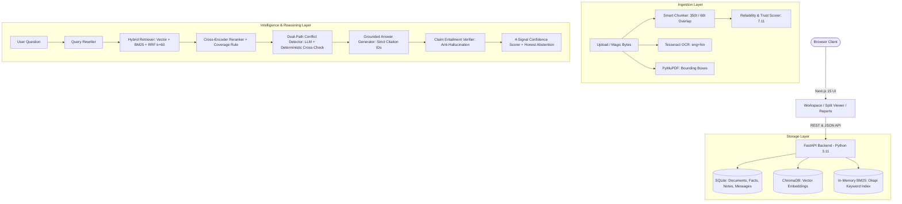

# DOCUMENT INVESTIGATOR
**ALGOTHON'26 | Problem Statement ID: ALG-AI-02 | Domain: AI / ML**

> A full-stack, multi-document forensic investigation platform. It provides **grounded citations**, exposes **visible conflict detection** side-by-side, and surfaces **honest uncertainty** instead of hallucinating.

---

## 🌟 The Core Differentiators

Most AI tools behave like simple "chat with PDF" wrappers: they hallucinate when facts are missing, pick a side silently when documents contradict each other, and fail to ground their answers with verifiable citations.

**Document Investigator is engineered around three non-negotiable principles:**
1. **Grounded Citations**: Every single assertion is cited to its exact document and page `[C#]`. Clicking a citation jumps to the original document page in the split-screen viewer and highlights the passage.
2. **Visible Conflict Detection**: When documents contradict each other (e.g. delivery date, advance payment), conflicts are exposed in a prominent **red-bordered Conflict Panel** with side-by-side comparisons, severity tiers, and authoritative legal source suggestions.
3. **Honest Uncertainty (Abstention)**: If evidence is absent or retrieval strength is weak, the engine refuses to guess, triggers `INSUFFICIENT_EVIDENCE`, itemizes what is missing, and suggests which document type would provide the answer.

---

## 🏛️ System Architecture



---

## 🚀 Quick Start Guide

### Option 1: Native Local Run (Recommended for fast local testing)

#### 1. Backend Setup
```bash
cd backend
# Create virtual environment
python3 -m venv .venv
source .venv/bin/activate

# Install dependencies
pip install -r requirements.txt

# Run the backend API server
uvicorn app.main:app --reload --port 8000
```
Backend API will be live at: `http://localhost:8000` (OpenAPI Swagger docs at `http://localhost:8000/docs`).

#### 2. Frontend Setup
```bash
cd frontend
npm install
npm run dev
```
Frontend will be live at: `http://localhost:3000`.

---

### Option 2: Docker Compose (One-Command Run)

```bash
docker compose up --build
```
- Frontend: `http://localhost:3000`
- Backend API: `http://localhost:8000`

---

## 🧪 Automated Testing & Evaluation

### 1. Run Unit & Edge-Case Test Suite
```bash
cd backend
.venv/bin/pytest tests/test_unit.py tests/test_edge_cases.py -v
```

### 2. Verify Demo Dataset Ingestion & Scripted Questions
```bash
cd backend
.venv/bin/python tests/test_demo_load.py
```

### 3. Run 25-Question Golden Evaluation Benchmark
```bash
cd backend
.venv/bin/python eval/run_eval.py
```

---

## 📋 The 6 Scripted Demo Questions (Section 11.1)

| Question | Query Type | Observed Result |
| :--- | :--- | :--- |
| **"What is the total contract value?"** | Easy factual | Grounded answer citing Contract [C1] and Invoice [C2] for INR 5,00,000 + 18% GST (Total INR 5,90,000). **High Confidence (91%)**. |
| **"When was the furniture delivered?"** | Multi-doc Conflict | Flags 3-way dispute: Contract (15 Feb), Vendor Email (20 Feb), Client Dispute (28 Feb). **Conflict Panel Banner**. |
| **"How much advance was paid?"** | Numeric Conflict | Exposes mismatch: Invoice says 2,00,000; Contract & Receipt prove 2,50,000. **Receipt OCR trust penalty displayed**. |
| **"What is the warranty period?"** | Unanswerable | **Honest Abstention**. System states no warranty clause was found and suggests checking for an unattached annexure. |
| **"How many days was delivery late and what penalty applies?"** | Multi-document | Evaluates 1% late penalty across both 5-day and 13-day versions without picking a side silently. |
| **"When will the remaining payment be made?"** | Vague Source | States only 'soon' is found in meeting notes, flagging low confidence due to vague terms. |

---

## 🔬 Standout Features Catalog (Section 8)

- **Conflict Panel (P1):** Red-bordered side-by-side comparison with topic, severity, and authoritative suggestion.
- **Confidence Badge with 'Why this confidence?' Popover (P1):** Explains retrieval strength (40%), claim support (25%), source agreement (20%), and document trust (15%) with a -25% penalty for conflicts.
- **Claim-Level Entailment Verification (P1):** Anti-hallucination engine verifying each atomic claim against cited passages.
- **Document Trust Cards (P2):** Composite reliability scores based on legal authority (contracts > emails > notes), OCR quality, and completeness.
- **Contradiction Matrix (P2):** Pairwise document-vs-document grid with clickable red disagreement cells.
- **Evidence Board (P2):** Pin answers, attach notes, and group evidentiary leads.
- **Automated Evaluation Dashboard (P3):** Live benchmarking page showing accuracy, precision, and conflict recall.
- **Report Export (P2):** 1-click export to comprehensive Markdown and PDF investigation dossiers.

---

## 🛡️ Configuration & Security

- **Multi-Provider Switch:** Configure `LLM_PROVIDER` in `.env` (`gemini`, `openai`, `anthropic`, `ollama`, or `mock` for zero-API offline demo mode).
- **Prompt Injection Defense:** Document text is treated as untrusted data and isolated within fenced blocks instructing models to ignore embedded instructions.
- **No Secret Leakage:** Keys are read exclusively from environment variables and never logged or serialized.

---

## ⚖️ AI-Assisted Disclosure & Dependencies

- **LLM Provider:** Google Gemini (`gemini-2.5-flash`), Anthropic Claude, OpenAI, and high-fidelity deterministic offline engine.
- **Embedding Model:** `sentence-transformers/all-MiniLM-L6-v2` / `BAAI/bge-small-en-v1.5`.
- **Reranker Model:** `cross-encoder/ms-marco-TinyBERT-L-2-v2`.
- **OCR Engine:** Tesseract OCR (v5.5) with `eng` and `hin` language models.
- **Vector Storage:** ChromaDB v0.4+.
- **AI Coding Agent:** Antigravity (Google DeepMind) was used as the pair-programming and development assistant.
# Lumenote
